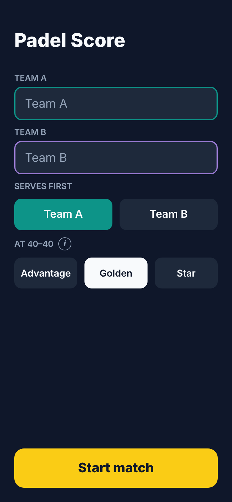
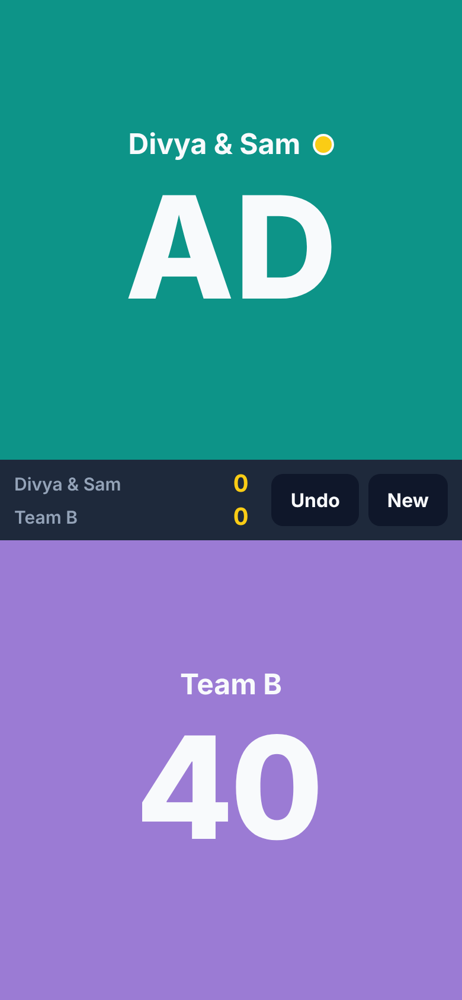
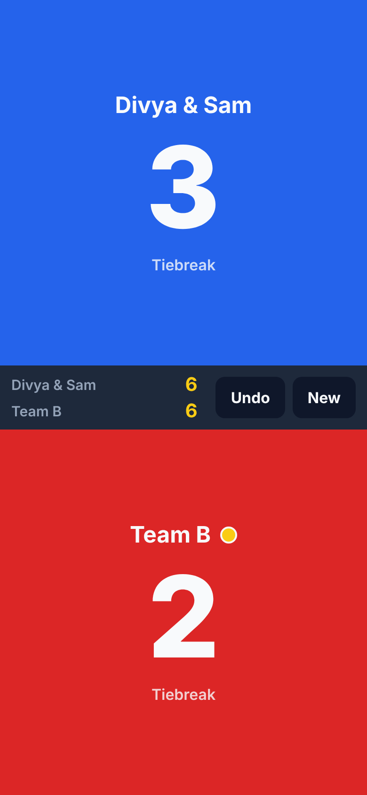
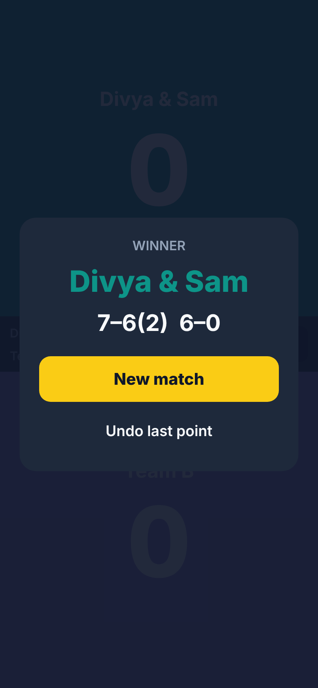

# Padel Point

Padel Point is a simple padel match scorekeeper for iOS (Expo / React Native, so Android works from the same code).

Design: [docs/superpowers/specs/2026-10-08-padel-score-design.md](docs/superpowers/specs/2026-10-08-padel-score-design.md)

<p>
  
  
  
  
</p>

## Getting the app onto your iPhone

The app runs inside **Expo Go** on the iPhone, and Expo Go loads it from your Mac. So there are
two parts: the Mac serves the app, the iPhone runs it.

You also need a free **Expo account**: Expo Go only opens projects when the Mac and the iPhone
are signed in to the same account. Create one at [expo.dev/signup](https://expo.dev/signup).

### On your Mac — one-time setup

You need [Node.js](https://nodejs.org) installed.

```bash
git clone https://github.com/divyasingh77488/padel-score.git
cd padel-score
npm install
npx expo login      # sign in with your Expo account
```

### On your iPhone — one-time setup

1. Install **Expo Go** from the App Store.
2. Open Expo Go and sign in with the **same Expo account** you used on the Mac.

### Each time you want to load the app

1. **On your Mac:** in the `padel-score` folder, run
   ```bash
   npm start
   ```
   A QR code appears in the terminal. Leave this running.
2. **On your iPhone:** make sure it's on the **same Wi-Fi** as the Mac. Open the **Camera** app,
   point it at the QR code and tap the banner. The app opens in Expo Go. (After the first time,
   you can also open it from **Recently opened** in Expo Go, as long as the Mac is running
   `npm start`.)

### If it doesn't open

- **"You need to be signed in to Expo Go and Expo CLI"**: run `npx expo login` on the Mac, sign
  in to Expo Go on the iPhone with the same account, then stop `npm start` (Ctrl+C), run it
  again and scan the new QR code. `npx expo whoami` on the Mac shows which account it's using.
- **It can't connect / keeps loading**: the iPhone can't reach the Mac (for example on office or
  hotel Wi-Fi). Run `npx expo start --tunnel` on the Mac instead of `npm start`.

### Before you go to the court

Once the app is open on the iPhone, you don't need the Mac any more, **as long as the app stays
open**. Locking the iPhone or switching to another app is fine. If the app is fully closed
(swiped away) while you're away from the Mac, Expo Go can't load it again until you're back
with the Mac running `npm start`. Your match isn't lost: it's saved on the iPhone and comes back
when the app reopens.

### Install it as a real app (no Mac or Wi-Fi needed on court)

This builds the app with Xcode and installs it on your iPhone, so it opens from the Home Screen
like any other app and works offline. It's free with a normal Apple ID, but the install
**expires after 7 days**; repeat the last step to reinstall.

**One-time setup on your Mac:**

1. Install **Xcode** (free, Mac App Store) and the iPhone platform:
   `xcodebuild -downloadPlatform iOS`.
2. In **Xcode → Settings → Accounts**, click **+** and sign in with your Apple ID.

**One-time setup on your iPhone:**

1. Connect it to the Mac with a cable, unlock it and tap **Trust**.
2. Turn on **Settings → Privacy & Security → Developer Mode** (it appears after connecting to
   Xcode) and restart when asked.

**Install (and every 7 days to reinstall):** with the iPhone connected and unlocked, run on
the Mac in the `padel-score` folder:

```bash
npx expo run:ios --device --configuration Release
```

Pick your iPhone from the list. If it asks for a **development team**, choose the one with
your Apple ID. The first build takes several minutes.

The first time the app opens, the iPhone may say the developer isn't trusted: go to
**Settings → General → VPN & Device Management**, tap your Apple ID and tap **Trust**.

## How to use it (on your iPhone)

Everything from here on happens on the iPhone.

### 1. Set up the match

- **Team names:** type a name for each team, or leave them blank to use "Team A" and "Team B".
- **Serves first:** tap the team that serves the first game.
- **At 40–40:** choose how a game is decided from deuce (default **Golden**). Tap the **ⓘ**
  button to read what each option means:
  - **Advantage:** a team must win two points in a row. Can go on for a long time.
  - **Golden:** the next point wins the game.
  - **Star:** advantage at the first two deuces; at the third deuce the next point wins
    (the official FIP rule).
- Tap **Start match**.

### 2. Score each point

The screen is split in two: the top half (teal) is the first team and the bottom half (lilac) is
the second team.

- **After each rally, tap anywhere on the half of the team that won the point.** The whole half
  is a button, so you don't need to aim.
- The big number is the score in the current game: `0`, `15`, `30`, `40`. What happens at
  40–40 depends on the rule you picked:
  - with advantage (and the first two deuces of star point), the team that wins the next point
    shows `AD`; if they lose the next point it goes back to `40–40`;
  - when the next point decides the game (golden point, or the third deuce of star point), the
    screen says **"Golden point: next point wins"** or **"Star point: next point wins"**.
- The **yellow ball** next to a team's name shows which team is serving. It moves automatically.
- The bar in the middle shows the **games** for each team:
  - the yellow number is the set being played now;
  - earlier sets are shown to its left (the set winner's number is brighter);
  - after a tiebreak, the small number next to the set score is that team's tiebreak points.

The screen stays on while the match screen is open, so it doesn't lock between points.

### 3. Fix a mistake

- Tap **Undo** to remove the last point. Tap it again to keep going back, one point at a time,
  all the way to the start of the match. Undo works across games and sets too.

### 4. Tiebreak

At 6–6 in a set the app switches to a tiebreak automatically ("Tiebreak" appears under the
score). Points are counted 1, 2, 3… and the first team to 7 with a 2-point lead wins the set
7–6. The serve indicator follows tiebreak serving: one point for the first server, then two
points each.

### 5. End of the match

When a team wins two sets the match is over and a summary shows:

- the winner and the final score, for example `7–6(2)  6–0` (written from the winner's side;
  the number in brackets is the loser's tiebreak points);
- **New match:** go back to the setup screen;
- **Undo last point:** if the last point was a mis-tap, reopens the match.

To abandon a match before it ends, tap **New** in the middle bar. The app asks before it
discards the match.

### 6. Match history

Tap **History** at the top of the setup screen to see your finished matches, newest first: the
date, who won, the final score and the rule at 40–40. A match is saved there when you tap
**New match** after it ends (so a last-second **Undo** never saves a wrong result); matches you
abandon with **New** are not saved. Long-press a match to delete it, or tap **Clear** to delete
them all. History is kept on the iPhone only.

### If the app closes

Every point is saved on the iPhone. If the app is closed or the iPhone restarts, the match comes
back exactly where you left it when you open the app again.

## Scoring rules

- Games: 0, 15, 30, 40, game. At 40–40, the rule chosen at setup: advantage, golden point or
  star point (see above). Tiebreaks always play to 7, win by 2.
- Sets: first to 6 games with a 2-game lead (6–4, 7–5). Tiebreak at 6–6.
- Tiebreak: first to 7 points with a 2-point lead (7–5, 10–8).
- Match: best of 3 sets.
- Serve changes every game. In a tiebreak the first server serves 1 point, then teams alternate
  every 2 points. The team that received first in the tiebreak serves first in the next set.

## Development (on your Mac)

```bash
npm test           # scoring engine + storage unit tests
npm run typecheck
```

Code layout:

- `src/scoring/` – pure TypeScript scoring engine. A match is the list of point winners;
  `computeScore` replays it, so undo is just dropping the last point.
- `src/state/` – `useMatch` hook and AsyncStorage persistence.
- `src/screens/` – setup screen, match screen, match-over overlay.
